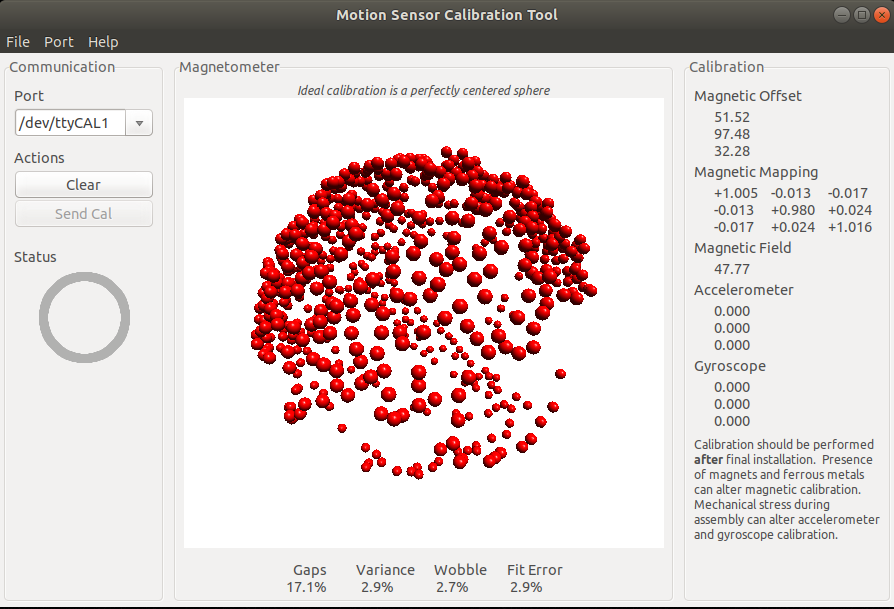

### FXIMU Calibration

When the `calibration_mode` is set to `1` in the fximu_params.yaml file, the unit outputs raw sensor values at `/imu/raw` topic.

The complementary filter is not initialized, and the hard iron and soft iron corrections are not processed, but device is configured according to `sensor_read_rate`, `output_rate_divider`, `gfsr`, and `afsr`on the yaml file.

#### Procedure

>Notice: sudo apt install socat

1. Set `calibration_mode` to 1, and select `sensor_read_rate` 100hz and `output_rate_divider` to 2 setting output rate to 50hz, in the fximu_params.yaml file.

2. Run `roslaunch fximu fx.launch` to launch rosserial.

3. Run `rostopic echo /imu/raw` to verify raw data is being published, and device is in calibration mode.

4. Run `socat.sh` provided in scripts directory. This will create `/dev/ttyCAL0` and `/dev/ttyCAL1` virtual ports.

5. Run `perms.sh` provided in the scripts directory. This will fix the permissions of newly created devices.

6. Run `cal_bridge.py` program provided in the scripts directory. This python program will read data from `/imu/raw` topic, and then send those values to `/dev/ttyCAL0`, which will be forwarded to `/dev/ttyCAL1` by socat, as plaintext raw values.

7. Verify that the calibration system is running: `screen /dev/ttyCAL1 115200` you should see values running as:

> Raw:-73,2054,120,22,-17,51,232,631,277

To quit screen press `CTRL-A` and `\` keys.

#### [TODO: /imu/raw explanation]

#### Important

**If you are making the calibration on robot, Steps 1, 2, 3 should be done in the robot, while the 4,5,6,7 should pe performed on the host.**

#### MotionCal

To Perform the actual calibration: Download and compile https://github.com/altineller/MotionCal. This is a slightly modified version of the https://github.com/PaulStoffregen/MotionCal. The portslist.cpp file has been modified so it can see our pseudo terminal `/dev/ttyCAL1` port.

The prerequisites for compiling the program under ubuntu 20.04 are explained at https://github.com/altineller/MotionCal/blob/master/README.md

Compile the program by issuing `make`. If you have problems building MotionCal program, see: https://forum.pjrc.com/threads/57378-Cannot-make-MotionCal-for-Linux

You should turn the sensor until you see see red dots arranged as a sphere like in the picture below:

Rotate the sensor in all directions until gaps are less than 1% and variance less than 2%. At this state you can get a screenshot of calibration screen, and put those values in the hard and soft iron correction matrices defined in fximu_params.yaml file.

