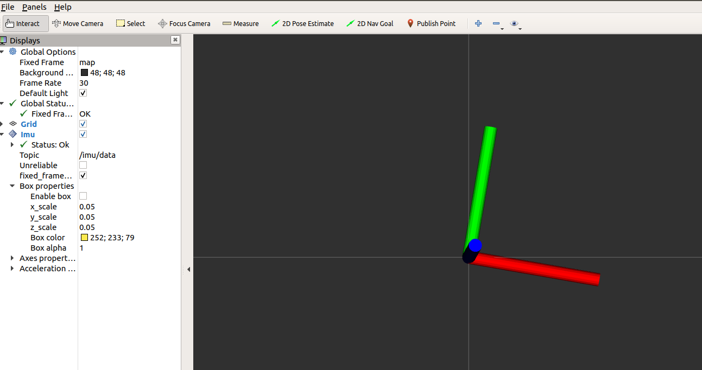

### HOWTO

**Notes for the users of the FXIMU**

#### Prerequisites

sudo apt install ros-noetic-rviz-imu-plugin -y  
sudo apt install socat -y  

#### Load parameters 

```
rosparam load config/fximu_params.yaml
```

>Notice: roscore must be running


#### Run rosserial

```
rosrun rosserial_python serial_node.py _port:=/dev/ttyACM0 _baud:=230400
```

#### Run static transform publisher for rviz

```
rosrun tf static_transform_publisher 0.0 0.0 0.0 0.0 0.0 0.0 map base_imu_link 100 
```

#### Run RVIZ

Note that rviz imu plugin is required to visualize imu data. Click Add on rviz, then select rviz\_imu\_plugin then type 'imu/data' as topic in the visualization window.

#### Launch files

[TODO: add more about launch files in readme.md]

Use `fximu.launch` to load parameters and launch FXIMU. Use `fxviz.launch` to launch FXIMU and RVIZ displaying orientation.



#### View IMU data

```
rostopic echo /imu/data
```

#### View magnetometer data

```
rostopic echo /imu/mag
```

#### Measure frequency of output data

```
rostopic hz /imu/data
```

Or
  
```
rostopic hz /imu/mag
```


#### Plot IMU data

[TODO]

#### Plot Magnetometer data

[TODO]

#### Measure Gravity

First launch FXIMU, then:

```
roscd fximu/scripts
./measure_gravity.py
```

It will print the value of **gravity constant**. Make sure the FXIMU is fixed and does not move before running.Wait at least 1000 cycles for the averaging filter to converge.


#### Measure Thresholds

FXIMU detects stationary mode by using number of thresholds. Once the device is in stationary mode, it self calibrates sensor biases. To measure the thresholds for your imu follow the following procedure:

```
roscd fximu/scripts
./measure.thresholds.py
```

This will print measurements, if the thresholds are exceeded. So depending on the output, change the following lines accordingly:

```console
self.kAccelerationThreshold = 0.19
self.kAngularVelocityThreshold = 0.055
self.kDeltaAngularVelocityThreshold = 0.033
```

`kAccelerationThreshold` is the threshold for accelerometer values.

`kAngularVelocityThreshold` is the threshold for the gyro values.

`kDeltaAngularVelocityThreshold` is the threshold for the derivative of gyro values.

Tune these manually, until the program `measure_thresholds` does not produce any output.


#### If you are developing on Ubuntu

ModemManager service that is default on ubuntu, probes the newly added serial ports, which keeps it busy for few second. To overcome this delay turn off the ModemManager service.
